# Groww Weekly Digest — Master Architecture Blueprint

> **Version:** 4.0 | **Date:** 2026-03-26 | **Status:** Production-Ready  
> **Product:** Groww App | **Frontend:** Next.js 14 (Vercel) | **Backend:** FastAPI (Streamlit Cloud) | **LLM:** Groq (3-Key Rotation) → Gemini Fallback | **MCP:** Google Docs API + Gmail API (OAuth2)

---

## Table of Contents

| # | Section | What It Covers |
|---|---------|---------------|
| 1 | [Overall System Architecture](#1-overall-system-architecture) | Full system diagram, data flow, phase dependencies |
| 2 | [Tech Stack](#2-tech-stack) | Every technology with version, purpose, and install command |
| 3 | [Repository Structure](#3-repository-structure) | Every file path mapped to its phase |
| 4 | [Phase 0: Environment Setup](#4-phase-0-environment-setup) | Config system, secrets, directory creation |
| 5 | [Phase 1: Data Ingestion](#5-phase-1-data-ingestion) | Robust scrapers for reviews and fees |
| 6 | [Phase 2: LLM Routing Engine](#6-phase-2-llm-routing-engine) | Groq/Gemini router with fallback and retry |
| 7 | [Phase 3: Weekly Review Pulse](#7-phase-3-weekly-review-pulse) | Part A — review analysis pipeline |
| 8 | [Phase 4: Fee Explainer](#8-phase-4-fee-explainer) | Part B — fee explanation generator |
| 9 | [Phase 5: FastAPI Backend](#9-phase-5-fastapi-backend) | REST API endpoints, middleware, error handling |
| 10 | [Phase 6: Next.js Frontend](#10-phase-6-nextjs-frontend) | UI components, state, API integration |
| 11 | [Phase 7: MCP Integration](#11-phase-7-mcp-integration) | Part C — Google Docs + Gmail dispatch |
| 12 | [Phase 8: Testing & Deployment](#12-phase-8-testing--deployment) | Test matrix, deploy configs |
| 13 | [Architectural Constraints](#13-architectural-constraints) | 6 hard rules the system must follow |
| 14 | [Risk Register](#14-risk-register) | 9 risks with mitigations |

---

## 1. Overall System Architecture

### 1.1 Complete System Diagram

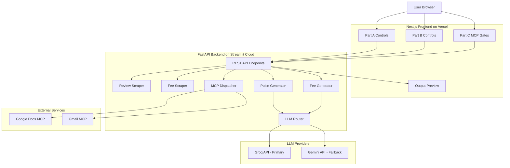

### 1.2 Data Flow — Step by Step

```mermaid
graph LR
    S1["Step 1: User sets params"] --> S2["Step 2: Next.js calls FastAPI"]
    S2 --> S3["Step 3: Playwright scrapes data"]
    S3 --> S4["Step 4: Data filtered and saved as JSON"]
    S4 --> S5["Step 5: Data sent to LLM Router"]
    S5 --> S6["Step 6: Try Groq then Gemini"]
    S6 --> S7["Step 7: LLM returns structured JSON"]
    S7 --> S8["Step 8: Result sent to frontend"]
    S8 --> S9["Step 9: User reviews and approves MCP"]
    S9 --> S10["Step 10: Dispatch to Docs and Gmail"]
```

### 1.3 Phase Dependency Map

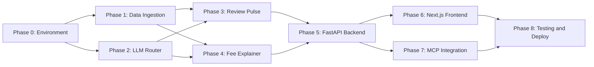

**Build order:** 0 → (1 + 2 in parallel) → (3 + 4 in parallel) → 5 → (6 + 7 in parallel) → 8

---

## 2. Tech Stack

| Package | Version | Phase | Purpose |
|---------|---------|-------|---------|
| Python | 3.9+ | 0 | Runtime |
| Node.js | 18+ | 6 | Frontend runtime |
| **FastAPI** | ≥0.109 | 5 | Backend REST API framework |
| **Uvicorn** | ≥0.27 | 5 | ASGI server for FastAPI |
| **google-play-scraper** | ≥1.2 | 1 | Industrial-grade review ingestion (replaces Playwright for reviews) |
| **BeautifulSoup4** | ≥4.12 | 1 | HTML table parsing for Groww fee pages |
| **emoji** | ≥2.8 | 0 | Counting and filtering emojis in reviews |
| **langdetect** | ≥1.0 | 0 | Strict English-only word detection |
| Groq SDK | ≥0.4 | 2 | Primary LLM API client |
| google-generativeai | ≥0.3 | 2 | Fallback LLM API client |
| **google-api-python-client** | ≥2.0 | 7 | Google Docs API + Gmail API access |
| **google-auth-httplib2** | ≥0.1 | 7 | OAuth2 HTTP transport |
| **google-auth-oauthlib** | ≥1.0 | 7 | OAuth2 desktop flow for token generation |
| python-dotenv | ≥1.0 | 0 | Load `.env` secrets |
| PyYAML | ≥6.0 | 0 | Parse `config.yaml` |
| Pydantic | ≥2.0 | 5 | Request/response validation (comes with FastAPI) |
| Next.js | 14 | 6 | React framework with App Router |
| pytest | ≥7.4 | 8 | Testing framework |

### Why FastAPI over Flask or pure Streamlit

- **Async native** — Playwright scraping is async; FastAPI handles it natively
- **Pydantic validation** — Request/response schemas are auto-validated
- **Auto-generated Swagger docs** — `/docs` endpoint for free
- **Streamlit Cloud deployment** — A thin `streamlit_app.py` wrapper launches Uvicorn; Streamlit Cloud just needs a Streamlit entry point
- **Performance** — Fastest Python web framework

---

## 3. Repository Structure

```
M2_MCP_AI_Automation/
├── architecture.md                ← THIS FILE (Single Source of Truth)
├── requirements.txt               ← Phase 0
├── .env.example / .env            ← Phase 0 (secrets)
├── config.yaml                    ← Phase 0 (all tunable params)
├── .gitignore                     ← Phase 0
│
├── backend/
│   ├── __init__.py                ← Package marker
│   ├── config.py                  ← Phase 0 — Config loader (.env + YAML)
│   ├── utils.py                   ← Phase 0 — PII filters, token counter, date helpers, dispatch formatters
│   ├── phase1/                    ← Phase 1 — Data Ingestion
│   │   ├── scraper_reviews.py     ← google-play-scraper + 7-step filter
│   │   └── scraper_fees.py        ← Playwright fee scraper
│   ├── phase2/                    ← Phase 2 — Specialized LLM Engine
│   │   └── llm_router.py         ← 3-Key Groq rotation + Gemini fallback
│   ├── phase3/                    ← Phase 3 — Weekly Review Pulse
│   │   └── pipeline_reviews.py   ← Map-Reduce review analysis + theme star ratings
│   ├── phase4/                    ← Phase 4 — Fee Explainer
│   │   └── pipeline_fees.py      ← KB-grounded anti-hallucination pipeline
│   ├── phase5/                    ← Phase 5 — FastAPI Backend
│   │   ├── main.py               ← FastAPI app entry point
│   │   ├── routes.py             ← API route definitions
│   │   └── models.py             ← Pydantic request/response models
│   └── phase7/                    ← Phase 7 — Google Workspace Integration
│       ├── auth.py               ← OAuth2 token generation script
│       ├── google_mcp_server.py  ← Real Google Docs + Gmail API server (JSON-RPC over stdio)
│       └── mcp_dispatcher.py     ← MCP dispatch with gated operations + content formatting
│
├── data/                          ← Runtime JSON (git-ignored)
│   ├── .gitkeep                   ← Preserves dir in git
│   ├── reviews_filtered.json      ← Phase 1 output
│   ├── fee_kb.json                ← Phase 1 output
│   ├── weekly_pulse.json          ← Phase 3 output
│   └── fee_explainer.json         ← Phase 4 output
│
├── frontend/                      ← Next.js 14 App Router (Phase 6)
│   ├── src/
│   │   ├── app/
│   │   │   ├── layout.tsx, page.tsx, globals.css
│   │   │   └── api/ (pulse/, explainer/, dispatch/) ← Next.js proxy routes
│   │   ├── components/
│   │   │   ├── PartAControls.tsx    ← Pulse config sliders
│   │   │   ├── PartBControls.tsx    ← Asset class selector
│   │   │   ├── PartCGates.tsx       ← MCP dispatch gates (Doc/Draft)
│   │   │   └── OutputPreview.tsx    ← Rich report preview
│   │   └── types/index.ts         ← TypeScript interfaces
│   ├── __tests__/                 ← Jest Component Tests
│   └── jest.config.js
│
└── tests/                         ← Python test suite
    ├── conftest.py                ← Shared fixtures
    ├── test_config.py, test_utils.py, test_scraper_*.py
    └── phase2/, phase3/, phase4/, phase5/, phase7/, phase8/
```

---

## 4. Phase 0: Environment Setup

### ELI5

> You're setting up a kitchen before cooking. You're putting all the utensils in place (installing packages), writing down the recipe measurements (config.yaml), and locking away the secret ingredients (API keys in .env). Without this, no other phase can even start.

### What to Build

1. **`requirements.txt`** — list every Python package with minimum version
2. **`.env.example`** — template with all required API key names (no real values)
3. **`.env`** — real API keys, git-ignored
4. **`config.yaml`** — single source of truth for every tunable parameter (max weeks, themes count, token budgets, TTLs, MCP server commands, etc.)
5. **`backend/config.py`** — a module that loads `.env` + `config.yaml` and exposes a `settings` dict and a `get_setting("dot.path")` helper
6. **`backend/utils.py`** — shared utility functions: PII regex scrubber, token estimator, cache TTL checker, JSON file I/O, content formatters for MCP dispatch
7. **`tests/conftest.py`** — shared fixtures (sample config, sample reviews, sample fee KB)
8. **Directory scaffolding** — `backend/`, `data/`, `tests/`, `frontend/`

### Logic Details for an Implementing Agent

**`config.py` logic:**
- Call `load_dotenv()` at import time so env vars are available immediately
- Read `config.yaml` from project root using `Path(__file__).parent.parent / "config.yaml"`
- Override specific config values with env vars (e.g., `GOOGLE_DOCS_DOC_ID` overrides `mcp.google_docs.document_id`)
- Expose module-level `settings` dict (loaded once, cached)
- `get_setting("part_a.max_weeks")` splits on `.` and walks the dict
- Configure Python `logging` based on `config.app.log_level`

**`utils.py` must provide these functions:**

| Function | Logic | Used By |
|----------|-------|---------|
| `scrub_pii(text)` | Regex-replace emails, 10-13 digit phones, Aadhaar patterns with `[REDACTED]` | Phase 1, 3 |
| `estimate_tokens(text)` | Return `len(text) // 4` (rough: 1 token ≈ 4 chars) | Phase 2, 3 |
| `fits_in_context(text, window, ratio)` | Check if `estimate_tokens(text) < window * ratio` | Phase 3 |
| `is_cache_valid(path, ttl_hours)` | Check file exists AND `mtime` is within `ttl_hours` | Phase 1 |
| `save_json(data, path)` | Write dict/list to JSON with `indent=2` | Phase 1, 3, 4 |
| `load_json(path)` | Read and parse JSON file | Phase 1, 3, 4 |
| `format_pulse_for_dispatch(pulse_dict)` | Convert pulse JSON → human-readable text for Doc/Email | Phase 7 |
| `format_explainer_for_dispatch(explainer_dict)` | Convert explainer JSON → human-readable text | Phase 7 |

**`config.yaml` must define:** See the full schema in section 4.2 below.

### 4.2 `config.yaml` Complete Schema

```yaml
app:
  name: "AI Ops Automator"
  version: "3.0"
  log_level: "INFO"

part_a:
  app_id: "com.nextbillion.groww"
  play_store_url: "https://play.google.com/store/apps/details?id=com.nextbillion.groww&showAllReviews=true"
  max_weeks: 8
  default_weeks: 4
  max_reviews: 200
  default_max_reviews: 100
  star_range_min: 1
  star_range_max: 5
  min_word_count: 10
  language: "en"
  max_themes: 5
  top_themes_count: 3
  quotes_count: 3
  summary_max_words: 250
  action_ideas_count: 3

part_b:
  asset_classes: ["Stocks", "F&O", "Mutual Funds"]
  max_bullets: 6
  official_links_count: 2
  pricing_urls:
    Stocks: "https://groww.in/pricing"
    "F&O": "https://groww.in/pricing"
    "Mutual Funds": "https://groww.in/pricing"

mcp:
  google_docs:
    server_command: "npx @anthropic/google-docs-mcp"
    document_id: ""
  gmail:
    server_command: "npx @anthropic/gmail-mcp"
    default_recipients: []
    subject_prefix: "[AI Ops Automator]"

llm:
  groq:
    model: "llama-3.3-70b-versatile"
    max_tokens: 2048
    temperature: 0.3
    timeout_seconds: 30
    context_window: 8192
  gemini:
    model: "gemini-2.0-flash"
    max_tokens: 2048
    temperature: 0.3
    timeout_seconds: 60
    context_window: 32768
  routing:
    max_retries: 3
    backoff_base_seconds: 2
    token_budget_ratio: 0.67

scraping:
  playwright:
    headless: true
    timeout_ms: 30000
    viewport_width: 1280
    viewport_height: 720
  cache:
    reviews_ttl_hours: 24
    fee_kb_ttl_hours: 168
```

### Phase 0 Diagram

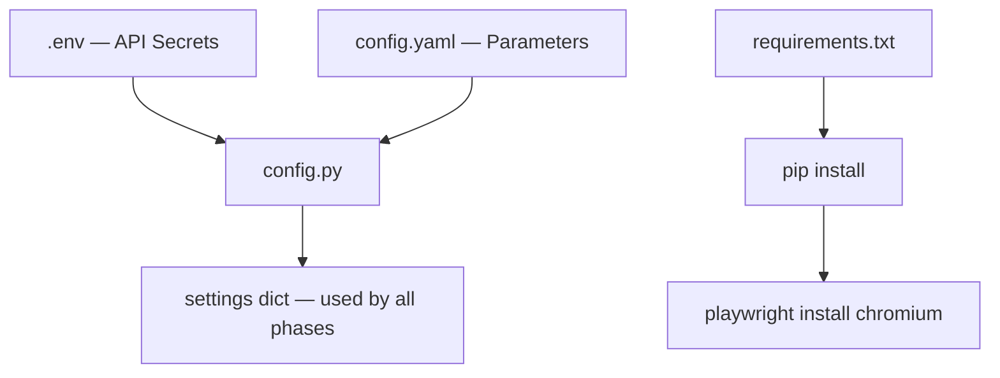

### Phase 0 Exit Criteria

- [x] All directories exist: `backend/`, `data/`, `tests/`, `frontend/`
- [x] `pip install -r requirements.txt` succeeds
- [x] `playwright install chromium` succeeds
- [x] `.env` has real `GROQ_API_KEY_1`, `GROQ_API_KEY_2`, and `GEMINI_API_KEY`
- [x] `python -c "from backend.config import settings; print(settings['app']['name'])"` prints `"AI Ops Automator"`
- [x] `pytest tests/test_config.py tests/test_utils.py -v` — all pass

---

## 5. Phase 1: Data Ingestion

### ELI5

> Imagine you need to know what people are saying about a restaurant. You go to Yelp (Google Play Store), read through reviews, throw out the ones in a language you can't read, throw out the one-word reviews like "nice" or "bad", cross out any phone numbers or emails (privacy!), and sort the rest so the angriest reviews are on top. Similarly, you go to the restaurant's website, copy their price menu, and organize it neatly. Now you have two tidy notebooks ready for analysis.

### What to Build

Two independent scrapers that can each run standalone:

1. **`backend/phase1/scraper_reviews.py`** — google-play-scraper + 7-step filter pipeline
2. **`backend/phase1/scraper_fees.py`** — Playwright-based Groww pricing page scraper

### Sub-Phase 1A: Review Scraper Logic

#### How It Works — Step by Step

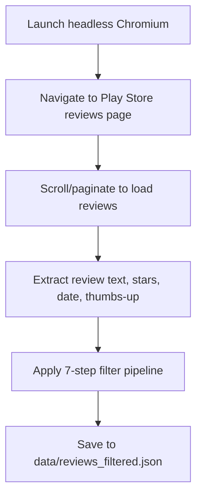

#### The 7-Step Filter Pipeline

Each filter is applied in order. A review must pass ALL filters to survive:

| Step | Filter | Logic | Why |
|------|--------|-------|-----|
| 1 | **Language = English** | Check review `lang` attribute OR use ASCII ratio heuristic (>80% ASCII = English) | LLM prompts are English; non-English reviews become noise |
| 2 | **Word count > 10** | `len(review_text.split()) > config.part_a.min_word_count` | "Good app" has zero analytical value |
| 3 | **Date within N weeks** | `review_date >= (today - N_weeks)` where N comes from UI slider | Stale reviews don't reflect current product state |
| 4 | **Star rating in range** | `min_star <= review.score <= max_star` from UI range slider | User controls whether to focus on critical (1-2★) or all reviews |
| 5 | **PII scrubbing** | Run `utils.scrub_pii()` on review text | Legal compliance — no personal data sent to LLM |
| 6 | **Sort by stars ascending** | `sorted(reviews, key=lambda r: r['score'])` | Most critical reviews first = highest signal for the LLM |
| 7 | **Truncate to max_reviews** | `reviews[:config.part_a.max_reviews]` | Prevent LLM token overflow |

#### Caching Strategy

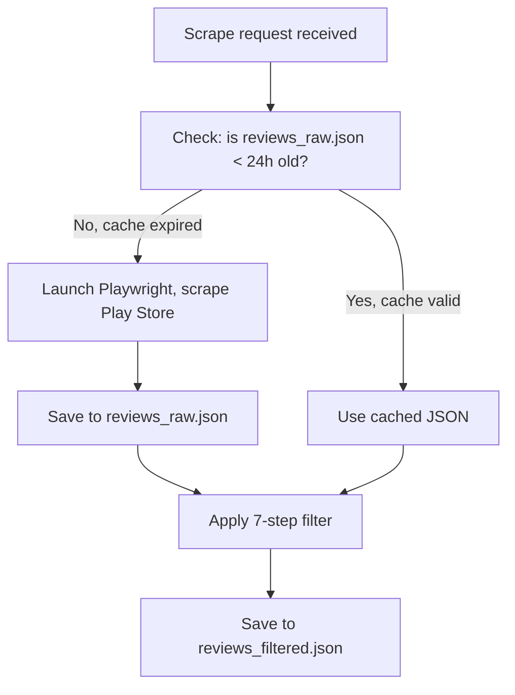

**Decision:** Cache TTL is 24 hours (`config.scraping.cache.reviews_ttl_hours`). Scraping Play Store on every request is slow (~15-30s) and risks IP blocking.

#### Output Schema: `data/reviews_filtered.json`

```json
{
  "scraped_at": "2026-03-24T00:00:00Z",
  "filters_applied": { "weeks": 4, "star_range": [1, 3], "max_reviews": 100, "min_words": 10 },
  "total_raw": 342,
  "total_filtered": 87,
  "reviews": [
    {
      "id": "gp_abc123",
      "content": "The mutual fund SIP feature keeps failing when I try to set up auto-debit...",
      "score": 1,
      "date": "2026-03-20",
      "thumbs_up": 42,
      "word_count": 23
    }
  ]
}
```

#### Key Functions the Implementing Agent Must Create

| Function | Parameters | Returns | Logic |
|----------|-----------|---------|-------|
| `scrape_reviews(app_id, max_count)` | Play Store app ID string, int | list of raw review dicts | Async Playwright: open Chrome, navigate, scroll, extract |
| `filter_reviews(raw, weeks, star_range, max_reviews, min_words)` | raw list + filter params | filtered list | Apply all 7 filters in sequence |
| `run_review_pipeline(config)` | config dict | saves JSON, returns file path | Orchestrator: check cache → scrape if needed → filter → save |

### Sub-Phase 1B: Fee Scraper Logic

#### How It Works — Step by Step

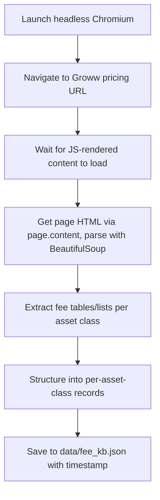

#### Why Playwright for Fee Scraping (not requests)

Groww's pricing page uses JavaScript to render fee tables. A plain `requests.get()` returns empty/skeleton HTML. Playwright runs a real Chromium browser that executes the JS, then we grab the fully rendered HTML and parse it with BeautifulSoup.

#### Caching Strategy

Same TTL pattern as reviews, but with **7-day TTL** (`config.scraping.cache.fee_kb_ttl_hours = 168`). Fee structures change rarely — weekly re-scrape is sufficient. The `last_scraped` timestamp in the output lets the LLM add "Last checked: {date}" to the fee explainer.

#### Output Schema: `data/fee_kb.json`

```json
{
  "last_scraped": "2026-03-24T00:00:00Z",
  "source": "https://groww.in/pricing",
  "asset_classes": {
    "Stocks": {
      "fees": [
        { "name": "Brokerage", "value": "₹20 per order or 0.05%", "category": "trading" },
        { "name": "STT", "value": "0.025% on sell side", "category": "regulatory" }
      ],
      "official_links": ["https://groww.in/pricing", "https://support.groww.in/charges"],
      "notes": "Zero brokerage on delivery trades"
    },
    "F&O": { "fees": [], "official_links": [], "notes": "" },
    "Mutual Funds": { "fees": [], "official_links": [], "notes": "" }
  }
}
```

#### Key Functions

| Function | Parameters | Returns | Logic |
|----------|-----------|---------|-------|
| `scrape_fee_page(url)` | URL string | rendered HTML string | Async Playwright: open page, wait for content, return `page.content()` |
| `parse_fee_tables(html)` | HTML string | dict per asset class | BeautifulSoup: find fee tables/lists, extract name+value pairs |
| `build_fee_kb(config)` | config dict | full `fee_kb` dict | Scrape all pricing URLs, merge, add timestamp |
| `run_fee_pipeline(config)` | config dict | saves JSON, returns path | Orchestrator: check cache → scrape if needed → parse → save |

### Phase 1 Overall Diagram

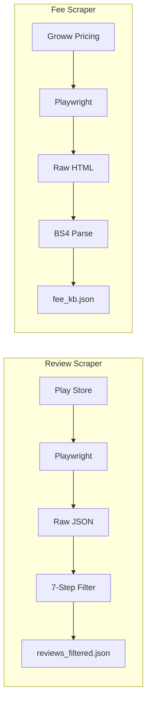

### Phase 1 Exit Criteria

- [x] Review scraper returns valid JSON with ≥1 review matching filters
- [x] Fee scraper returns valid JSON with all 3 asset classes populated
- [x] PII scrubbing removes test emails and phone numbers from reviews
- [x] Caching works — second run within TTL uses cached file, no re-scrape
- [x] Both scrapers can run standalone: `python -m backend.phase1.scraper_reviews` and `python -m backend.phase1.scraper_fees`

---

### Specialized LLM Engine Strategy

To handle heavy operations while maintaining quality, the engine is split into two specialized routes:

1.  **Classification Path (High Volume)**:
    - **Primary**: **Groq (llama3-70b)**.
    - **Strategy**: **Multi-Key Rotation** (Key 1 & Key 2) to bypass free-tier 429 rate limits.
    - **Batching**: Process reviews in parallel chunks across different keys.
2.  **Generation Path (High Reasoning)**:
    - **Primary**: **Gemini 2.0 Flash** (referred to as 2.5 flash in some contexts).
    - **Goal**: Weekly Pulse summarizing, Fee explaining, and drafting.
    - **Benefit**: Larger context window and higher reasoning quality for "One Page" summaries.

### Routing & Multi-Key Logic (Groq)

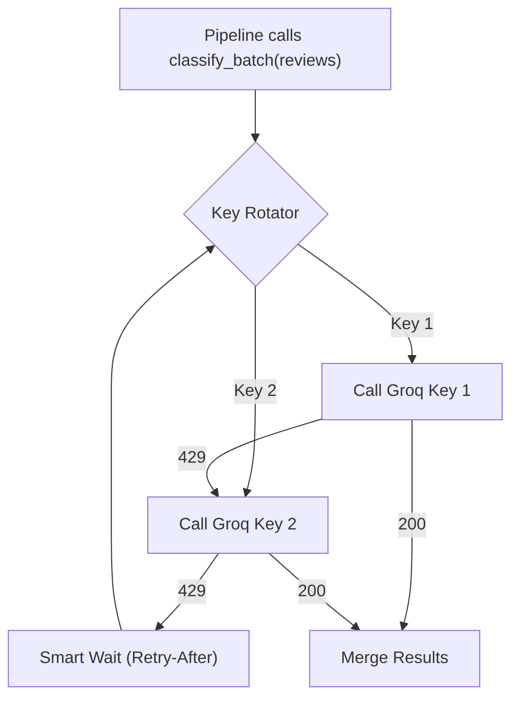

### Interface Contract

The implementing agent must create:

| Method | Parameters | Returns | Logic |
|--------|-----------|---------|-------|
| `__init__()` | — | — | Load `GROQ_API_KEY_1`, `GROQ_API_KEY_2`, and `GEMINI_API_KEY` |
| `classify_batch(reviews)` | review list | `List[Classified]` | Dual-key parallel rotation for high-volume mapping |
| `generate_one_page(...)` | prompt + params | `LLMResponse` | Default to Gemini 2.0 Flash for reasoning/summaries |
| `fits_in_context(...)` | prompt + provider | `bool` | Provider-aware budget check |
| `_call_groq_with_key(...)` | prompt + key_id | `LLMResponse` | Scoped call using Key 1 or Key 2 from rotation pool |

**`LLMResponse` dataclass fields:**

| Field | Type | Description |
|-------|------|-------------|
| `content` | `str` | Raw text or JSON string from LLM |
| `provider` | `str` | `"groq"` or `"gemini"` — which one actually responded |
| `tokens_used` | `int` | Tokens consumed by this call |
| `latency_ms` | `int` | Wall-clock milliseconds |
| `model` | `str` | Exact model name used |

### Logging Requirements

Every LLM call must log: provider tried, model, token count, latency, success/failure.
Every fallback event must log: reason (429/timeout/error), retry count, backoff wait time.

### Phase 2 Exit Criteria

- [x] `llm_router.generate("Hello")` returns valid `LLMResponse` with real Groq key
- [x] When Groq returns 429 (mock it), router calls Gemini and succeeds
- [x] When both fail (mock both), `LLMUnavailableError` is raised after 3 retries
- [x] `estimate_prompt_tokens()` returns values within 20% of actual (tested)
- [x] All 8 tests in `tests/test_llm_router.py` pass

---

## 7. Phase 3: Weekly Review Pulse (Part A)

### ELI5

> You've got a big stack of complaint letters (reviews). You need to write a 1-page report for the boss. First, you sort the letters into piles by topic (themes). Then you count which piles are biggest (top 3). You pull out the 3 most interesting quotes word-for-word. You write a short summary paragraph. And you suggest 3 things to fix. That's the Weekly Pulse.

### What to Build

`backend/phase3/pipeline_reviews.py` — takes filtered reviews from Phase 1 and produces the Weekly Pulse JSON via the LLM Router from Phase 2.

### Processing Logic

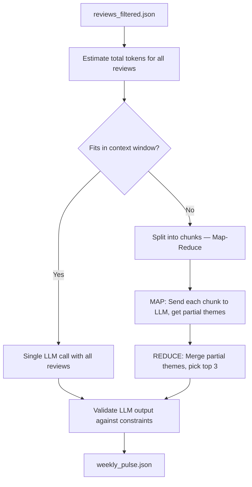

### Chunking Strategy (Map-Reduce)

**When it triggers:** If `estimate_tokens(all_reviews_text) >= context_window * 0.67`

**Map phase:**
1. Split reviews into chunks of ~50 reviews each
2. Send each chunk to LLM with prompt: "Extract themes from these reviews"
3. Each chunk returns partial themes with review counts

**Reduce phase:**
1. Merge all partial themes by name (combine counts)
2. Send merged themes to LLM: "From these themes, pick top 3, select 3 quotes, write summary, suggest 3 actions"
3. Return final pulse JSON

**Chunk size calculation:**
- `available_input_tokens = context_window * token_budget_ratio` (e.g., 8192 × 0.67 = 5,489)
- `avg_tokens_per_review ≈ 50 words / 4 = 12 tokens`
- `chunk_size = available_input_tokens / avg_tokens_per_review` (e.g., ~450 reviews per chunk)
- In practice: use 50 reviews per chunk as a safe default

### Prompt Engineering Strategy

**System prompt must enforce:**
1. Group reviews into AT MOST `{max_themes}` themes (from config)
2. Rank themes by frequency — most review mentions = rank 1
3. Select EXACTLY `{quotes_count}` verbatim quotes — do NOT paraphrase, copy word-for-word
4. Write a summary of AT MOST `{summary_max_words}` words
5. Suggest EXACTLY `{action_ideas_count}` actionable improvements
6. Do NOT include any personally identifiable information
7. Return ONLY valid JSON matching the schema (provide schema in prompt)

### Post-LLM Validation Logic (6 checks)

The implementing agent must validate LLM output and auto-fix violations:

| Check | Condition | Auto-Fix If Failed |
|-------|-----------|-------------------|
| 1 | `len(themes) <= max_themes` | Truncate to `max_themes` by highest review count |
| 2 | `len(top_3_themes) == 3` | Pick top 3 from themes by review count |
| 3 | `len(quotes) == 3` | If fewer: sample additional quotes from raw reviews. If more: take first 3 |
| 4 | `word_count(summary) <= 250` | Truncate at 250th word, add "..." |
| 5 | `len(action_ideas) == 3` | If fewer: make another LLM call for actions only. If more: take first 3 |
| 6 | No PII in output | Run `scrub_pii()` on all text fields |

### Output Schema: `data/weekly_pulse.json`

```json
{
  "generated_at": "2026-03-24T00:15:00Z",
  "provider_used": "groq",
  "period": "2026-02-24 to 2026-03-24",
  "total_reviews_analyzed": 87,
  "themes": [
    { "name": "App Crashes During Payment", "review_count": 23, "sentiment": "negative", "rank": 1 },
    { "name": "Slow Portfolio Loading", "review_count": 18, "sentiment": "negative", "rank": 2 },
    { "name": "Confusing Mutual Fund UI", "review_count": 15, "sentiment": "negative", "rank": 3 }
  ],
  "top_3_themes": ["App Crashes During Payment", "Slow Portfolio Loading", "Confusing Mutual Fund UI"],
  "quotes": [
    { "text": "Every time I try to pay, the app just freezes and I have to restart.", "star_rating": 1, "date": "2026-03-18" },
    { "text": "Loading my portfolio takes 30 seconds, this is unacceptable.", "star_rating": 2, "date": "2026-03-15" },
    { "text": "I cannot figure out how to switch between direct and regular mutual funds.", "star_rating": 2, "date": "2026-03-12" }
  ],
  "summary": "Over the past 4 weeks, analysis of 87 Groww app reviews reveals three dominant concerns...",
  "action_ideas": [
    "Prioritize payment gateway stability in the next sprint.",
    "Add loading skeleton screens to reduce perceived latency.",
    "Conduct a UX audit on the mutual fund selection flow."
  ]
}
```

### Key Functions

| Function | Logic |
|----------|-------|
| `generate_weekly_pulse(reviews, llm_router, config)` | Main orchestrator: token check → single call or map-reduce → validate → return |
| `_build_pulse_prompt(reviews, config)` | Format reviews + system instructions into a single prompt string |
| `_chunk_reviews(reviews, max_tokens_per_chunk)` | Split review list into sublists that fit within token budget |
| `_map_reduce_themes(chunks, llm_router, config)` | Map: themes per chunk. Reduce: merge + final pulse generation |
| `_validate_pulse_output(pulse_dict, config)` | Run all 6 validation checks, auto-fix violations |

### Phase 3 Exit Criteria

- [x] Small review set (10 reviews) produces valid pulse JSON with correct schema
- [x] Large review set (200+ reviews) triggers chunking and still produces valid output
- [x] All 6 validation checks pass (test with intentionally malformed LLM output)
- [x] Summary is ≤250 words, exactly 3 quotes, exactly 3 actions
- [x] No PII in output (test by injecting email/phone into reviews)

---

## 8. Phase 4: Fee Explainer (Part B)

### ELI5

> Your friend asks "How much does it cost to trade stocks on Groww?" Instead of making up an answer, you open Groww's official price list (the knowledge base you scraped), read the numbers, and write 6 simple bullet points explaining each charge. You add two links to Groww's website so they can check themselves, and you write down "I checked this on March 24th" so they know how fresh the info is.

### What to Build

`backend/phase4/pipeline_fees.py` — takes a user-selected asset class, loads the fee KB from Phase 1, and generates a structured ≤6 bullet explanation using the LLM Router.

### Processing Logic

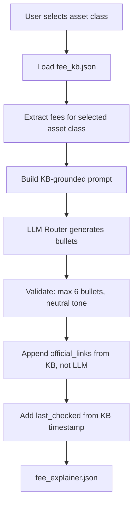

### Anti-Hallucination Strategy (KB-Grounded Prompting)

**Problem:** LLMs can hallucinate fee amounts or invent charges that don't exist.

**Solution:** The prompt ONLY contains fee data from `fee_kb.json`. The system prompt explicitly instructs:

> *"Use ONLY the fee data provided below. Do NOT add any fees or charges not present in the data. If you are unsure about a fee, do NOT include it. Do NOT use marketing or promotional language."*

**Critical rule for implementing agent:** The `official_links` and `last_checked` fields must come from `fee_kb.json`, NOT from the LLM output. The LLM only generates the explanation bullets. Links and timestamps are appended programmatically after the LLM call.

### Prompt Template Logic

The implementing agent should build the prompt like this:
1. System role: "You are a financial fee explanation assistant for Groww."
2. Inject the fee data for the selected asset class as JSON
3. Instructions: "Write at most {max_bullets} bullet points. Neutral tone. One sentence per bullet. Return valid JSON."
4. Provide the expected response schema in the prompt

### Output Schema: `data/fee_explainer.json`

```json
{
  "generated_at": "2026-03-24T00:20:00Z",
  "provider_used": "groq",
  "asset_class": "Stocks",
  "explanation_bullets": [
    "Groww charges a flat brokerage of ₹20 per executed order or 0.05% of trade value, whichever is lower.",
    "Securities Transaction Tax (STT) of 0.025% is levied on the sell side by the government.",
    "Exchange transaction charges vary by exchange: NSE charges 0.00297% and BSE charges 0.00300%.",
    "GST at 18% is applied on brokerage and exchange transaction charges combined.",
    "SEBI turnover fee of ₹10 per crore is charged on all equity trades.",
    "Stamp duty charges vary by state and are levied on buy-side transactions."
  ],
  "official_links": ["https://groww.in/pricing", "https://support.groww.in/charges"],
  "last_checked": "2026-03-24",
  "tone": "neutral"
}
```

### Key Functions

| Function | Logic |
|----------|-------|
| `generate_fee_explainer(asset_class, fee_kb, llm_router, config)` | Load KB → build prompt → call LLM → validate → append links+timestamp → return |
| `_build_fee_prompt(asset_class, fee_data, config)` | Embed fee records into prompt with anti-hallucination instructions |
| `_validate_explainer(result, fee_kb, asset_class, config)` | Check ≤6 bullets, append real links from KB, set last_checked, flag promotional language |

### Phase 4 Exit Criteria

- [x] Each of the 3 asset classes produces valid explainer JSON
- [x] Bullets are ≤6 per output
- [x] `official_links` come from `fee_kb.json`, NOT from LLM generation
- [x] `last_checked` matches `fee_kb.json`'s `last_scraped` date
- [x] Requesting an invalid asset class (e.g., "Crypto") returns a clear error

---

## 9. Phase 5: FastAPI Backend

### ELI5

> You've built all the smart parts — the scrapers, the LLM router, the pulse generator, the fee explainer. But they're all just functions sitting in files. Now you need to put them behind a door that the frontend can knock on. FastAPI creates three doors (endpoints): knock on `/api/pulse` to get a weekly pulse, knock on `/api/explainer` to get fee bullets, knock on `/api/dispatch` to send stuff to Docs/Gmail. Each door validates what you pass in, runs the right pipeline, and hands back a JSON response.

### What to Build

Three files in `backend/phase5/`:
- **`main.py`** — FastAPI app initialization, CORS middleware, startup events, health check
- **`routes.py`** — Three POST endpoints with Pydantic-validated requests/responses + UI filter logic
- **`models.py`** — Pydantic models defining exact request and response shapes

### How to Run

```bash
uvicorn backend.phase5.main:app --reload --host 127.0.0.1 --port 8000
```

### Backend Architecture Diagram

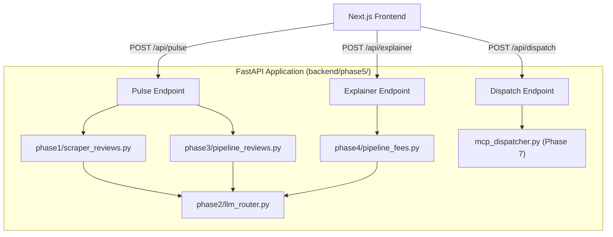

### API Endpoint Specifications

#### `POST /api/pulse`

| Field | Detail |
|-------|--------|
| **Purpose** | Generate Weekly Review Pulse (Part A) |
| **Request body** | `{ "weeks": int (1-8), "max_reviews": int (10-200), "star_range_min": int (1-5), "star_range_max": int (1-5) }` |
| **Internal logic** | 1. Run review scraper (or use cache). 2. Apply UI filters (weeks, star_range, max_reviews). 3. Pass in-memory reviews to `ReviewPulsePipeline.run(reviews_data=...)`. 4. Return result. |
| **Success response** | `{ "status": "success", "provider_used": "groq"/"gemini", "latency_ms": int, "data": { ...weekly_pulse schema... } }` |
| **Error response** | `{ "status": "error", "error": "description" }` |

#### `POST /api/explainer`

| Field | Detail |
|-------|--------|
| **Purpose** | Generate Fee Explainer (Part B) |
| **Request body** | `{ "asset_class": "Stocks" / "F&O" / "Mutual Funds" }` |
| **Internal logic** | 1. Call `FeeExplainerPipeline.run(asset_class)`. 2. Return result. |
| **Success response** | `{ "status": "success", "provider_used": "groq"/"gemini", "latency_ms": int, "data": { ...fee_explainer schema... } }` |
| **Error response** | `{ "status": "error", "error": "Invalid asset class: Crypto" }` |

#### `POST /api/dispatch`

| Field | Detail |
|-------|--------|
| **Purpose** | Dispatch generated content via Google Workspace APIs (Part C) |
| **Request body** | `{ "content_type": "combined", "content": { "pulse": {...}, "explainer": {...} }, "approvals": { "append_to_doc": bool, "create_draft": bool }, "recipients": ["email@x.com"] }` |
| **Internal logic** | 1. Format content via `utils.format_pulse_for_dispatch()` + `format_explainer_for_dispatch()`. 2. Check each gate. 3. For Gate 1: launch `google_mcp_server.py` subprocess, send `append_text` JSON-RPC. 4. For Gate 2: send `create_draft` JSON-RPC. 5. Return per-gate status. |
| **Success response** | `{ "status": "success", "results": { "doc": {"status": "appended"/"skipped"}, "draft": {"status": "created"/"skipped"} } }` |
| **Note** | Auto-send is disabled for security. Drafts must be manually sent by the user. |

### Key Logic in `main.py`

| Concern | Design Decision |
|---------|----------------|
| **CORS** | Enable all origins in dev (`allow_origins=["*"]`), restrict to Vercel domain in prod |
| **Startup** | On app startup: verify API keys (GROQ_API_KEY_1, GEMINI_API_KEY) are present |
| **Error handling** | Catch `LLMUnavailableError` → return 503. Catch validation errors → return 422. Catch all else → return 500 with log |
| **Logging** | Middleware logs every request: method, path, status code, latency |
| **Health** | `GET /health` returns `{"status": "ok", "version": "3.0"}` |

### Phase 5 Exit Criteria

- [x] `uvicorn backend.phase5.main:app` starts without errors
- [x] `POST /api/pulse` with valid params returns weekly_pulse JSON (mocked test)
- [x] `POST /api/explainer` with `"Stocks"` returns fee_explainer JSON (mocked test)
- [x] `POST /api/dispatch` with all gates OFF returns all-skipped status
- [x] Invalid requests return 422 with descriptive error messages
- [x] `/docs` (Swagger UI) loads and shows all 4 endpoints (pulse, explainer, dispatch, health)
- [x] Auto-send without draft returns proper error
- [x] UI filter logic correctly applies star range, weeks, and max_reviews caps

---

## 10. Phase 6: Next.js Frontend

### ELI5

> This is the pretty control panel the user actually sees. It has knobs and switches (sliders, dropdowns, toggles) on the left, and a TV screen (preview panel) on the right showing the results. When the user turns a knob and presses a button, the panel sends a message to the backend and shows whatever comes back, formatted nicely.

### What to Build

A Next.js 14 App Router application with 4 React components and 3 API proxy routes.

### UI Layout Diagram

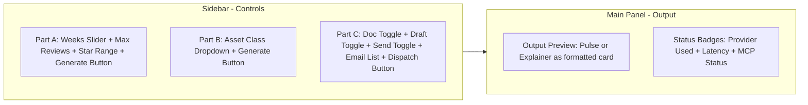

### Component Specifications

| Component | File | Controls / Display | Backend Call |
|-----------|------|--------------------|-------------|
| `PartAControls` | `components/PartAControls.tsx` | Weeks slider (1-8, default 4), Max reviews number input (10-200, default 100), Star range dual slider (1-5), Generate button | `POST /api/pulse` with `{weeks, max_reviews, star_range_min, star_range_max}` |
| `PartBControls` | `components/PartBControls.tsx` | Asset class dropdown (Stocks / F&O / Mutual Funds), Generate button | `POST /api/explainer` with `{asset_class}` |
| `PartCGates` | `components/PartCGates.tsx` | Three toggles (Doc append, Email draft, Auto-send — all OFF by default), Text area for email recipients (one per line), Dispatch button (disabled until at least one toggle is ON) | `POST /api/dispatch` with `{content_type, content, approvals, recipients}` |
| `OutputPreview` | `components/OutputPreview.tsx` | Shows generated pulse or explainer as a formatted card. Displays provider badge (Groq ⚡ / Gemini 🔄), latency in ms, MCP dispatch status per gate (✅ / ❌ / ⏭️ skipped) | Display only, no backend calls |

### API Route Proxy Logic

Each Next.js API route in `app/api/` acts as a proxy to avoid CORS issues:
1. Receive POST request from browser
2. Read `NEXT_PUBLIC_BACKEND_URL` from environment (default: `http://localhost:8000`)
3. Forward request body to FastAPI backend at the corresponding endpoint
4. Return backend response to browser

### State Management Logic

| State Variable | Type | Purpose | When Updated |
|---------------|------|---------|-------------|
| `pulseResult` | `object or null` | Stores Part A output for preview + dispatch | After successful `/api/pulse` response |
| `explainerResult` | `object or null` | Stores Part B output for preview + dispatch | After successful `/api/explainer` response |
| `isLoading` | `boolean` | Shows loading spinner, disables buttons | True while any API call is in-flight |
| `dispatchStatus` | `object` | Per-gate MCP status | After `/api/dispatch` response |
| `providerUsed` | `string` | Which LLM responded | Extracted from API response |
| `latencyMs` | `number` | How long the LLM call took | Extracted from API response |

No external state library needed — React `useState` is sufficient for this size.

### Design Requirements

- **Responsive:** Desktop = sidebar (30%) + main panel (70%). Mobile = stacked vertically.
- **Styling:** Vanilla CSS with CSS Grid/Flexbox. Modern, premium aesthetic (dark mode, glassmorphism, subtle animations).
- **Fonts:** Use Google Fonts (Inter or similar) via `next/font`.
- **Auto-send safety:** The auto-send toggle should have a visual warning (⚠️) and only be clickable if the draft toggle is also ON.

### Phase 6 Exit Criteria

- [x] `npm run dev` starts without errors on `localhost:3000`
- [x] All 4 components render with correct default values
- [x] Generate Pulse button triggers `/api/pulse` and displays result in preview
- [x] Generate Explainer button triggers `/api/explainer` and displays result in preview
- [x] Dispatch button respects toggle states (only calls approved gates)
- [x] Responsive layout works on mobile viewport (375px wide)

---

## 11. Phase 7: Google Workspace Integration (MCP — Part C)

### ELI5

> You've written a beautiful report. Now you want to share it. You have two options: paste it into a shared Google Doc (so the team can reference it), or create an email draft in Gmail (so you can review before sending). The system handles both via Google's official APIs, using OAuth2 for secure authentication. A "gate" system ensures nothing happens without your explicit approval.

### What We Actually Built

#### Architecture: How MCP Executes

The MCP layer consists of 3 files working together:

| File | Role | Communication |
|------|------|---------------|
| `mcp_dispatcher.py` | Orchestrator — formats content, checks gates, launches servers | Imports from `utils.py`, spawns subprocess |
| `google_mcp_server.py` | Worker — executes actual Google API calls | Reads JSON-RPC from stdin, writes results to stdout |
| `auth.py` | One-time setup — generates OAuth2 `token.json` | Interactive CLI script, run once |

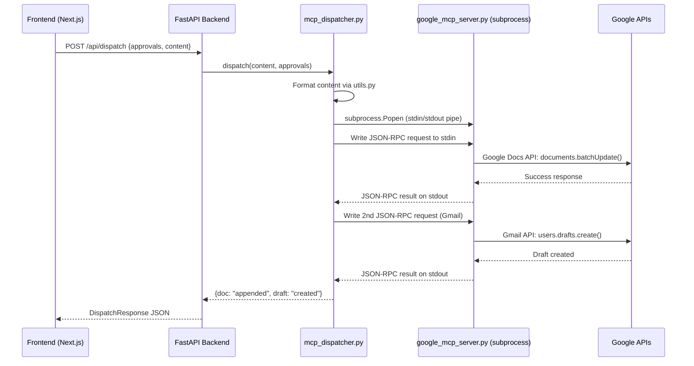

### 11.1 OAuth2 Authentication Flow

#### One-Time Setup: `auth.py`

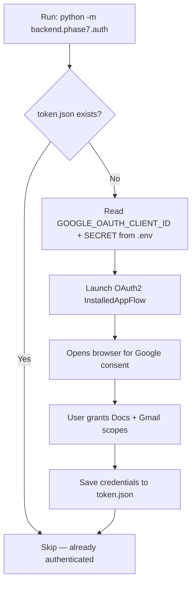

**Required `.env` variables:**
```
GOOGLE_OAUTH_CLIENT_ID=your-client-id.apps.googleusercontent.com
GOOGLE_OAUTH_CLIENT_SECRET=your-client-secret
GOOGLE_DOCS_DOC_ID=your-google-doc-id
```

**OAuth Scopes:**
- `https://www.googleapis.com/auth/documents` — Read/write Google Docs
- `https://www.googleapis.com/auth/gmail.compose` — Create/send email drafts

**Token Lifecycle:**
- `token.json` is auto-refreshed when expired (handled by `google.auth`)
- If `token.json` is deleted, re-run `python -m backend.phase7.auth`
- File is git-ignored for security

### 11.2 MCP Server: `google_mcp_server.py` — Exact Execution

This file is a **JSON-RPC server over stdio**. It does NOT use HTTP. The dispatcher launches it as a subprocess and communicates via stdin/stdout pipes.

#### Supported Tools (JSON-RPC Methods)

| Tool Name | Google API Used | What It Does Exactly |
|-----------|----------------|---------------------|
| `append_text` | `docs.documents().batchUpdate()` | 1. Fetches document to find end index. 2. Inserts a page break at the end. 3. Inserts formatted text after the page break. |
| `create_draft` | `gmail.users().drafts().create()` | Creates an email draft with specified to/subject/body. Draft stays in user's Gmail Drafts folder. |

#### Google Docs Append — Technical Detail

```python
# 1. Get document end index
doc = service.documents().get(documentId=doc_id).execute()
end_index = doc['body']['content'][-1]['endIndex'] - 1

# 2. Insert page break + text at the END (not beginning)
requests = [
    {'insertPageBreak': {'location': {'index': end_index}}},
    {'insertText': {'location': {'index': end_index + 1}, 'text': text}}
]
service.documents().batchUpdate(documentId=doc_id, body={'requests': requests}).execute()
```

**Critical design decision:** We append at the END of the document by dynamically reading `endIndex`. This ensures new reports are added chronologically without shifting existing content.

#### Gmail Draft — Technical Detail

```python
import base64
from email.mime.text import MIMEText

message = MIMEText(body)
message['to'] = to_addr
message['subject'] = subject
raw = base64.urlsafe_b64encode(message.as_bytes()).decode()
service.users().drafts().create(userId='me', body={'message': {'raw': raw}}).execute()
```

### 11.3 MCP Dispatcher: `mcp_dispatcher.py` — Gate Logic

#### Gate System (2 Gates)

| Gate | Condition to Execute | Side Effect |
|------|---------------------|-----------|
| Gate 1 (Doc append) | `approvals.append_to_doc == true` | Adds report to Google Doc on a new page |
| Gate 2 (Email draft) | `approvals.create_draft == true` | Creates Gmail draft (does NOT send) |

> **Security Note:** Auto-send was intentionally removed. Drafts must be manually sent by the user. This prevents unauthorized email transmission.

#### Content Formatting Pipeline

Before dispatching, raw JSON is transformed into a professional, icon-rich report:

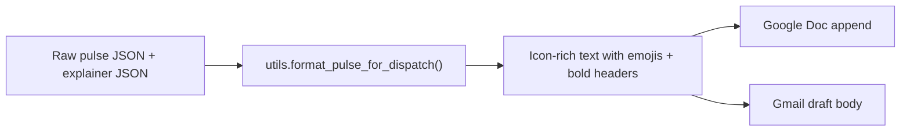

**Pulse Report Format:**
```
📊 **WeeklyProductPulse — Groww**
Week 2026-W13 | Mar 23 - Mar 26

📝 **Overview**
[Executive summary with percentage insights]

🔍 **Top Themes**
1. **High Brokerage Charges** (8 reviews • 28.6% • ★1.2)
2. **App Performance Issues** (6 reviews • 21.4% • ★1.3)
3. **Poor Customer Support** (4 reviews • 14.3% • ★1.0)

💬 **Verbatim User Quotes**
> "Exact user quote here"
> (Rating: 1★ • March 25, 2026)

💡 **Actionable Insights**
√ Prioritize payment gateway stability
√ Add loading skeleton screens
√ Conduct UX audit on mutual fund flow

*Report generated at March 26, 2026, 5:36 PM*
```

**Email Draft Format:**
```
Subject: Groww Weekly Pulse - Fee Explainer | Mar 23 - Mar 26

Dear Operations Team,

Please find below the consolidated Weekly Product Pulse for the period: Mar 23 - Mar 26.

[Full pulse report as above]

---
[Fee explainer section]

Best regards,
Groww Intelligence Hub
```

#### Date & Time Formatting Helpers

| Function | Input | Output |
|----------|-------|--------|
| `format_date_human()` | `2026-03-25T17:00:00Z` | `March 25, 2026` |
| `format_datetime_human()` | `2026-03-25T17:00:00Z` | `March 25, 2026, 5:00 PM` |
| `get_week_info()` | `2026-03-25T17:00:00Z` | `Week 2026-W13` |

All ISO timestamps are converted to human-readable format at dispatch time.

### 11.4 Enhanced Data Schema: Theme Metrics

The pipeline now calculates **per-theme average star ratings** during the Map phase:

```json
{
  "themes": [
    {
      "name": "High Brokerage Charges",
      "review_count": 8,
      "percentage": 28.6,
      "average_rating": 1.2
    }
  ]
}
```

This enables richer reporting where each theme shows its frequency, weight, and severity.

### 11.5 Error Handling

| Scenario | Behavior |
|----------|----------|
| `token.json` missing | Returns error: "OAuth token not found. Run auth.py" |
| Token expired | Auto-refreshes using stored refresh token |
| Google API error | Returns specific error message, other gates proceed independently |
| Doc append fails | Log error, email draft still proceeds |
| All gates OFF | Return immediately with all statuses = "skipped" |

### Phase 7 Exit Criteria

- [x] OAuth flow generates valid `token.json`
- [x] `append_text` adds content to end of Google Doc on new page
- [x] `create_draft` creates Gmail draft with professional formatting
- [x] Gate logic correctly skips disabled operations
- [x] Partial failure: if doc append fails, email draft still proceeds
- [x] All timestamps are human-readable in dispatched content

---

## 12. Phase 8: Testing & Deployment

### ELI5

> You've built every part of the car. Now you drive it around the block to see if anything rattles (E2E testing). You check each engine part individually (unit tests). And then you park it in the garage and put up a sign (deploy to Vercel + Streamlit Cloud).

### Full Test Matrix

| Test ID | Type | Phase | What It Validates |
|---------|------|-------|-------------------|
| T01 | Unit | 0 | Config loads `.env` + `config.yaml`, `get_setting()` works |
| T02 | Unit | 0 | PII scrubbing removes emails, phones, Aadhaar patterns |
| T03 | Unit | 0 | Token estimation returns reasonable values |
| T04 | Unit | 1 | Review filter pipeline produces correct subset |
| T05 | Unit | 1 | Fee KB has entries for all 3 asset classes |
| T06 | Unit | 2 | Groq succeeds → result has `provider: "groq"` |
| T07 | Unit | 2 | Groq 429 → fallback to Gemini succeeds |
| T08 | Unit | 2 | Both fail → `LLMUnavailableError` after 3 retries |
| T09 | Unit | 3 | Pulse has ≤5 themes, exactly 3 top, 3 quotes, ≤250 word summary, 3 actions |
| T10 | Unit | 3 | Map-Reduce chunking triggers on 200+ reviews |
| T11 | Unit | 4 | Explainer has ≤6 bullets, 2 links from KB, timestamp present |
| T12 | Unit | 7 | All MCP gates route correctly for each toggle combination |
| T13 | Integration | 5 | All 3 FastAPI endpoints return valid JSON responses |
| T14 | Integration | 3+5 | Reviews → LLM → pulse (with mocked LLM) |
| T15 | Integration | 4+5 | Fee KB → LLM → explainer (with mocked LLM) |
| T16 | Integration | 7 | Mock MCP servers, verify dispatch per gate |
| T17 | E2E | All | Real scrape → real LLM → real MCP (run sparingly) |
| T18 | Manual | 6 | All UI components render, defaults match config, responsive |

### Deployment Architecture

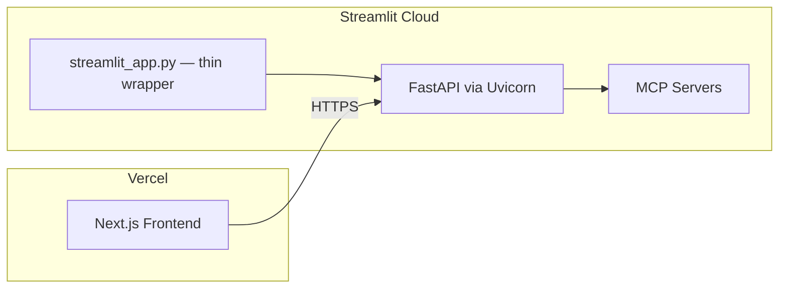

### Deployment Checklist

**Frontend (Vercel):**
- [ ] Connect GitHub repo to Vercel, set root directory to `frontend/`
- [ ] Set env var `NEXT_PUBLIC_BACKEND_URL=https://your-backend.streamlit.app`
- [ ] Verify auto-deploy on push to `main`

**Backend (Streamlit Cloud):**
- [ ] `streamlit_app.py` at project root launches Uvicorn + shows admin dashboard
- [ ] Set all secrets in Streamlit Cloud dashboard (equivalent of `.env`)
- [ ] Verify FastAPI endpoints are reachable from Vercel domain

**MCP Servers:**
- [ ] Google Docs MCP server running alongside backend
- [ ] Gmail MCP server running alongside backend
- [ ] OAuth tokens configured and valid

### Phase 8 Exit Criteria

- [x] All unit tests pass: `pytest tests/ -v` (56 passed)
- [x] Frontend component tests pass: `cd frontend && npm test` (4 passed)
- [x] Frontend builds: `cd frontend && npm run build` (no errors)
- [x] Backend server starts: `uvicorn backend.phase5.main:app`
- [x] Frontend dev server starts: `cd frontend && npm run dev`
- [x] Both servers accessible on localhost (8000 + 3000)

---

## 13. Architectural Constraints

These are **hard rules** that the implementing agent must follow. Violating any of these is a bug.

### Constraint 1: LLM Routing — Groq First, Gemini Fallback

| Property | Detail |
|----------|--------|
| **Rule** | Always try Groq first. Fall to Gemini ONLY on HTTP 429, timeout, or 5xx. Never use Gemini as primary. |
| **Where enforced** | `backend/llm_router.py` — `generate()` method |
| **Observable** | Every API response includes `provider_used` field. UI shows a provider badge. |
| **Logging** | Every fallback event logs: original error, retry count, backoff wait |

### Constraint 2: Phase Independence

| Property | Detail |
|----------|--------|
| **Rule** | Each phase's module must be importable and testable in isolation |
| **Where enforced** | Module boundaries: each `.py` file has clear input/output contract |
| **Observable** | Every phase has its own test file. Standalone scripts in `scripts/` (Phase 1) can run outside the app. |

### Constraint 3: Human-in-the-Loop MCP

| Property | Detail |
|----------|--------|
| **Rule** | No MCP tool call executes without explicit UI toggle being ON |
| **Where enforced** | `PartCGates.tsx` (UI) sends approval booleans → `mcp_dispatcher.py` checks them |
| **Default state** | ALL three toggles default to OFF. Auto-send requires draft toggle to also be ON. |

### Constraint 4: Hard Privacy Rule (Binary Discard)

| Property | Detail |
|----------|--------|
| **Rule** | ALL reviews containing PII (Email, Phone, Aadhaar) MUST be discarded immediately before storage. No scrubbing/redaction as a fallback. |
| **Where enforced** | `utils.has_pii()` check in `scraper_reviews.py` (filter step 2) |
| **Tested by** | Unit tests inject PII, assert `len(filtered) == 0` |

### Constraint 5: Strict Data Quality Rule

| Property | Detail |
|----------|--------|
| **Rule** | Reviews MUST be strictly English (Latin words only) and have ≤ 3 emojis. Discard otherwise. |
| **Where enforced** | `utils.is_english_strict()` and `count_emojis()` in `scraper_reviews.py` |

### Constraint 5: Token Budget Management

| Property | Detail |
|----------|--------|
| **Rule** | Never exceed LLM context window. If input is too large, chunk using Map-Reduce. |
| **Where enforced** | `utils.fits_in_context()` check before every LLM call. `pipeline_reviews._chunk_reviews()` for splitting. |
| **Config** | `llm.routing.token_budget_ratio: 0.67` — use at most 67% of context window for input |

### Constraint 6: Data Freshness via TTL Caching

| Property | Detail |
|----------|--------|
| **Rule** | Scraped data is cached with TTL. Do not re-scrape within TTL unless user forces refresh. |
| **Where enforced** | `utils.is_cache_valid()` called before every scrape. TTLs in `config.yaml`. |
| **TTLs** | Reviews: 24 hours. Fee KB: 168 hours (7 days). |

---

## 14. Risk Register

| # | Risk | Probability | Impact | Mitigation |
|---|------|-------------|--------|------------|
| R1 | Groq rate limit hit during demo | High | Medium | Gemini fallback is automatic and tested (T07) |
| R2 | Play Store blocks Playwright scraper | Medium | High | Cache raw reviews with 24h TTL; use cached data if scrape fails |
| R3 | Groww pricing page HTML structure changes | Medium | Medium | Fee KB versioned with `last_scraped`; scraper has `try/except` with clear error messages |
| R4 | MCP server crashes mid-dispatch | Low | High | Per-gate independent error handling; partial success is valid |
| R5 | LLM hallucinates fee amounts | Medium | High | KB-grounded prompting — LLM only sees real fee data. Links/timestamps added programmatically, not by LLM |
| R6 | Token overflow on large review sets | Medium | Medium | Auto-chunking via Map-Reduce (triggers when input exceeds 67% of context window) |
| R7 | Streamlit Cloud can't run FastAPI directly | Medium | Medium | Thin `streamlit_app.py` wrapper launches Uvicorn in subprocess. Alternative: deploy backend on Render |
| R8 | CORS issues between Vercel and backend | Low | Low | Next.js API routes act as proxy — browser never talks directly to backend |
| R9 | OAuth token expiry for MCP | Medium | Medium | Error handler returns specific "re-authenticate" message in API response |

---

## Appendix: Quick Reference — Phase Build Order

```
WEEK 1:
  Day 1-2: Phase 0 (Environment) — config, utils, tests
  Day 2-3: Phase 1 (Scrapers) + Phase 2 (LLM Router) — IN PARALLEL

WEEK 2:
  Day 4-5: Phase 3 (Pulse) + Phase 4 (Fee Explainer) — IN PARALLEL
  Day 5-6: Phase 5 (FastAPI Backend) — connect everything

WEEK 3:
  Day 7-8: Phase 6 (Next.js Frontend) + Phase 7 (MCP) — IN PARALLEL
  Day 9-10: Phase 8 (Testing + Deploy)
```


> **🚀 This architecture is final. Start with Phase 0. Each phase's exit criteria must be met before starting the next dependent phase.**

---

## 15. Folder & File Description (Self-Documenting)

Below is a breakdown of the key folders as we implement each phase. Each phase will have a specific folder or file in the `backend/` directory to maintain a clean structure.

| Folder | Phase | Description | Key Files |
|--------|-------|-------------|-----------|
| `backend/` | 0 | Core Python backend root with config and utilities. | `config.py`, `utils.py` |
| `backend/phase1/` | 1 | Scrapers for Play Store reviews and Groww pricing pages. | `scraper_reviews.py`, `scraper_fees.py` |
| `backend/phase2/` | 2 | Specialized dual-key Groq + Gemini LLM engine. | `llm_router.py` |
| `backend/phase3/` | 3 | Weekly review pulse Map-Reduce pipeline. | `pipeline_reviews.py` |
| `backend/phase4/` | 4 | Anti-hallucination fee explainer pipeline. | `pipeline_fees.py` |
| `backend/phase5/` | 5 | FastAPI backend with Pydantic validation. | `main.py`, `routes.py`, `models.py` |
| `backend/` | 7 | MCP dispatch with gated Google Docs + Gmail. | `mcp_dispatcher.py` |
| `data/` | 1-4 | Persistent storage for scraped/generated JSON (git-ignored). | `reviews_filtered.json`, `fee_kb.json` |
| `frontend/` | 6 | Next.js 14 frontend with React components and API proxy routes. | `src/app/page.tsx`, `src/components/` |
| `tests/` | 0-8 | Complete test suite organized by phase. | `phase2/`, `phase3/`, `phase5/`, `phase7/` |

- **`backend/phase1/scraper_reviews.py`**: Handles Play Store scraping and applies the 7-step review filter. Output: `data/reviews_filtered.json`.
- **`backend/phase1/scraper_fees.py`**: Scrapes Groww pricing pages for Stocks, F&O, and Mutual Funds. Output: `data/fee_kb.json`.


