# Groww Weekly Digest — Master Architecture Playbook

> **Version:** 5.0 | **Date:** 2026-03-27 | **Status:** ✅ Live in Production  
> **Frontend:** Next.js 16 on Vercel | **Backend:** FastAPI on Vercel Serverless (Python) | **LLM:** Groq (3-Key Rotation) + Gemini 2.0 Flash | **MCP:** Google Docs + Gmail (OAuth2 via JSON-RPC subprocess)

---

## Table of Contents

| # | Section | What It Covers |
|---|---------|---------------|
| 1 | [What This Project Does](#1-what-this-project-does) | Plain-English overview for anyone |
| 2 | [System Architecture](#2-system-architecture) | Full diagrams, data flows, component map |
| 3 | [Tech Stack](#3-tech-stack) | Every dependency with purpose |
| 4 | [Repository Structure](#4-repository-structure) | Every file mapped to its role |
| 5 | [Phase 0: Configuration](#5-phase-0-configuration) | Config system, secrets, environment |
| 6 | [Phase 1: Data Ingestion](#6-phase-1-data-ingestion) | Web scrapers for reviews and fees |
| 7 | [Phase 2: LLM Routing Engine](#7-phase-2-llm-routing-engine) | Groq/Gemini orchestration with Multi-Key Rotation |
| 8 | [Phase 3: Weekly Review Pulse](#8-phase-3-weekly-review-pulse) | Map-Reduce AI analysis pipeline |
| 9 | [Phase 4: Fee Explainer](#9-phase-4-fee-explainer) | Anti-hallucination KB-grounded generation |
| 10 | [Phase 5: FastAPI Backend](#10-phase-5-fastapi-backend) | REST API layer with security middleware |
| 11 | [Phase 6: Next.js Frontend](#11-phase-6-nextjs-frontend) | React dashboard with API proxy |
| 12 | [Phase 7: MCP Integration](#12-phase-7-mcp-integration) | Google Workspace dispatch via JSON-RPC |
| 13 | [Deployment Architecture](#13-deployment-architecture) | Vercel dual-project topology |
| 14 | [Security Model](#14-security-model) | API keys, OAuth, CORS |
| 15 | [Architectural Constraints](#15-architectural-constraints) | Hard rules the system enforces |

---

## 1. What This Project Does

### For a Non-Technical Reader

Groww is India's largest investment app. Every week, thousands of users leave reviews on the Google Play Store complaining about bugs, praising features, or asking for improvements. Simultaneously, Groww's pricing page lists all fees for Stocks, F&O, and Mutual Funds.

**This project automates the entire intelligence cycle:**
1. **Scrapes** Play Store reviews and Groww's pricing page without any human effort
2. **Analyzes** the reviews using AI (LLMs) to find the top complaints, extract real user quotes, and suggest fixes
3. **Explains** the fee structure in simple, jargon-free bullet points using AI
4. **Delivers** everything automatically to a Google Doc and a Gmail draft for the operations team

The entire pipeline runs from a single web dashboard. One click generates a full weekly intelligence report.

### For a Technical Reader

This is a **full-stack AI Operations Automator** implementing:
- **Data Ingestion**: `google-play-scraper` for review extraction + `requests/BeautifulSoup` for fee page scraping
- **AI Orchestration**: Multi-provider LLM engine (Groq 3-Key Rotation + Gemini 2.0 Flash fallback) with Map-Reduce chunking
- **Anti-Hallucination**: Knowledge-Base-grounded prompting where the LLM never generates facts — only explains data we give it
- **MCP Protocol**: Model Context Protocol via JSON-RPC over stdio to dispatch content to Google Workspace APIs
- **Cloud-Native Deployment**: Dual Vercel Serverless projects with ephemeral `/tmp` storage and stateless OAuth

---

## 2. System Architecture

### 2.1 Complete System Diagram

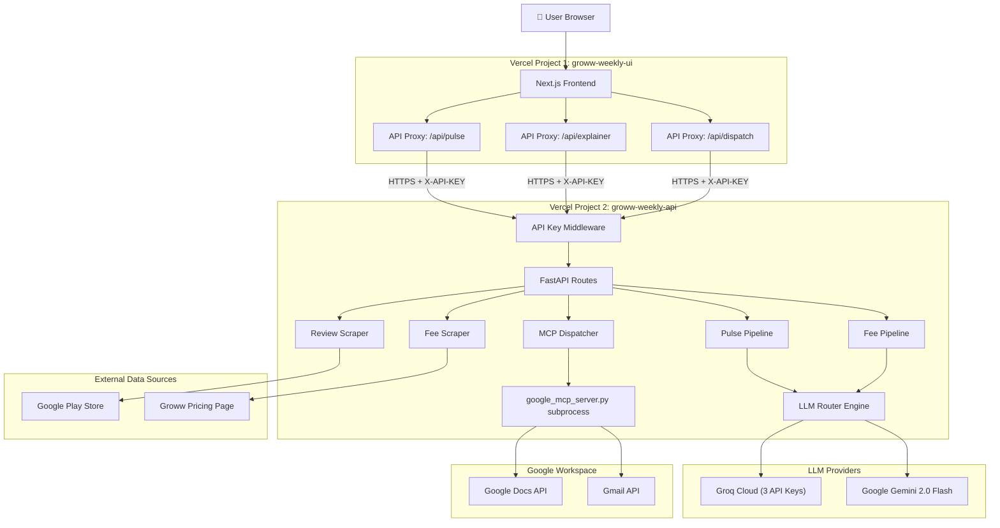

### 2.2 End-to-End Data Flow

```mermaid
graph LR
    S1["1️⃣ User sets filters in dashboard"] --> S2["2️⃣ Next.js proxy forwards to FastAPI"]
    S2 --> S3["3️⃣ Scraper fetches reviews/fees"]
    S3 --> S4["4️⃣ Data filtered, PII removed, cached"]
    S4 --> S5["5️⃣ LLM Router picks provider"]
    S5 --> S6["6️⃣ Map phase: Groq classifies chunks"]
    S6 --> S7["7️⃣ Reduce phase: Gemini writes report"]
    S7 --> S8["8️⃣ JSON result shown in dashboard"]
    S8 --> S9["9️⃣ User approves dispatch gates"]
    S9 --> S10["🔟 MCP server writes to Docs/Gmail"]
```

### 2.3 Phase Dependency Map

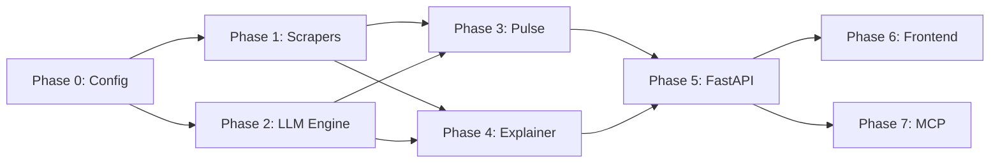

**Build order:** Phase 0 → (1 + 2 in parallel) → (3 + 4 in parallel) → 5 → (6 + 7 in parallel)

---

## 3. Tech Stack

| Package | Version | Phase | Purpose |
|---------|---------|-------|---------|
| Python | 3.9+ | All | Backend runtime |
| Node.js | 18+ | 6 | Frontend runtime |
| **FastAPI** | ≥0.109 | 5 | Async REST API framework with Pydantic validation |
| **Uvicorn** | ≥0.27 | 5 | ASGI server (local development only) |
| **google-play-scraper** | ≥1.2 | 1 | Fetches up to 10,000 Play Store reviews programmatically |
| **requests** | ≥2.31 | 1 | Lightweight HTTP client for fee page scraping |
| **BeautifulSoup4** | ≥4.12 | 1 | HTML table parser for fee data extraction |
| **emoji** | ≥2.8 | 0 | Detects and counts emojis in review text |
| **langdetect** | ≥1.0 | 0 | Strict English-only language detection |
| **Groq SDK** | ≥0.4 | 2 | Primary LLM client (llama-3.3-70b-versatile) |
| **google-generativeai** | ≥0.3 | 2 | Fallback LLM client (Gemini 2.0 Flash) |
| **google-api-python-client** | ≥2.0 | 7 | Google Docs + Gmail API access |
| **google-auth-oauthlib** | ≥1.0 | 7 | OAuth2 token generation |
| **python-dotenv** | ≥1.0 | 0 | Loads `.env` secrets |
| **PyYAML** | ≥6.0 | 0 | Parses `config.yaml` |
| **Next.js** | 16 | 6 | React framework with App Router |

### Why Not Playwright?

The original design used Playwright (a headless browser) for web scraping. This was replaced with `requests + BeautifulSoup` because:
- Playwright's Chromium binary is **~150MB**, exceeding Vercel's **50MB Serverless Function limit**
- `requests` is ~2MB and handles Groww's server-rendered pricing pages perfectly
- Play Store reviews use `google-play-scraper` (a dedicated library), not browser scraping

---

## 4. Repository Structure

```
M2_MCP_AI_Automation/
├── architecture.md              ← THIS FILE (Single Source of Truth)
├── API_DOCS.md                  ← API Reference & Protocol Internals
├── DEPLOY.md                    ← Step-by-step deployment guide
├── requirements.txt             ← Python dependencies
├── config.yaml                  ← All tunable parameters
├── .env / .env.example          ← API keys and secrets
├── vercel.json                  ← Backend Vercel routing config
├── token.json                   ← OAuth2 credentials (git-ignored)
│
├── api/
│   └── index.py                 ← Vercel Serverless entry point (imports FastAPI app)
│
├── backend/
│   ├── __init__.py
│   ├── config.py                ← Config loader (.env + YAML merger)
│   ├── utils.py                 ← Shared utilities (PII, caching, formatters, /tmp resolver)
│   ├── phase1/
│   │   ├── scraper_reviews.py   ← Play Store review ingestion + 6-step filter
│   │   └── scraper_fees.py      ← Groww pricing page scraper (requests + BS4)
│   ├── phase2/
│   │   └── llm_router.py        ← 3-Key Groq rotation + Gemini fallback engine
│   ├── phase3/
│   │   └── pipeline_reviews.py  ← Map-Reduce review analysis pipeline
│   ├── phase4/
│   │   └── pipeline_fees.py     ← KB-grounded anti-hallucination fee pipeline
│   ├── phase5/
│   │   ├── main.py              ← FastAPI app (CORS, middleware, health check)
│   │   ├── routes.py            ← 3 POST endpoints: /pulse, /explainer, /dispatch
│   │   └── models.py            ← Pydantic request/response schemas
│   └── phase7/
│       ├── auth.py              ← One-time OAuth2 token generator
│       ├── google_mcp_server.py ← JSON-RPC server (Google Docs + Gmail)
│       └── mcp_dispatcher.py    ← Gate logic + subprocess orchestrator
│
├── data/                        ← Runtime JSON cache (git-ignored)
│   ├── reviews_filtered.json    ← Scraped + filtered reviews
│   ├── fee_kb.json              ← Scraped fee knowledge base
│   ├── weekly_pulse.json        ← Generated review pulse
│   └── fee_explainer.json       ← Generated fee explanation
│
├── frontend/                    ← Next.js App (deployed as separate Vercel project)
│   ├── vercel.json              ← Frontend-specific Vercel config
│   ├── src/app/
│   │   ├── page.tsx             ← Main dashboard page
│   │   ├── layout.tsx           ← Root layout with metadata
│   │   ├── globals.css          ← Design system styles
│   │   └── api/                 ← Next.js API proxy routes
│   │       ├── pulse/route.ts
│   │       ├── explainer/route.ts
│   │       └── dispatch/route.ts
│   └── src/components/
│       ├── PartAControls.tsx    ← Pulse parameter controls
│       ├── PartBControls.tsx    ← Asset class selector
│       ├── PartCGates.tsx       ← MCP dispatch gates
│       └── OutputPreview.tsx    ← Rich report preview panel
│
└── tests/                       ← Python + JS test suites
```

---

## 5. Phase 0: Configuration

### ELI5
> Setting up a kitchen before cooking. You install the utensils (packages), write down recipe measurements (config.yaml), and lock away secret ingredients (API keys in .env).

### How It Works

**`config.py`** initializes the entire configuration system at import time:
1. Calls `load_dotenv()` to inject `.env` values into `os.environ`
2. Reads `config.yaml` from the project root
3. Merges environment variable overrides (`.env` takes priority over YAML)
4. Exposes a `get_setting("dot.path")` function used by every other module

### Real-Life Use Case: The "Agile Dev" Problem
**Problem:** In a fast-moving project, you constantly change LLM models or API keys. Hardcoding these means every change requires a code deployment.
**Solution:** Phase 0 allows an Ops person to swap a Groq key or change the review date window in `config.yaml`/`.env` without touching a single line of logic. Most settings can even be updated live in Vercel's UI.


**`utils.py`** provides shared utilities used across all phases:

| Function | What It Does | Used By |
|----------|-------------|---------|
| `scrub_pii(text)` | Regex-removes emails, 10-13 digit phones, Aadhaar patterns | Phase 1, 3 |
| `has_pii(text)` | Returns `True` if any PII pattern is found (binary discard) | Phase 1 |
| `is_english_strict(text)` | Confirms every word is Latin charset + langdetect = 'en' | Phase 1 |
| `estimate_tokens(text)` | Rough count: `len(text) // 4` | Phase 2, 3 |
| `is_cache_valid(path, ttl)` | Checks if file exists AND was modified within TTL hours | Phase 1 |
| `save_json(data, path)` | Writes JSON with `indent=2`, auto-remaps to `/tmp` on Vercel | Phase 1, 3, 4 |
| `load_json(path)` | Reads and parses JSON, auto-remaps to `/tmp` on Vercel | Phase 1, 3, 4 |
| `_resolve_path(path)` | If `VERCEL=1` env var is set, rewrites `data/...` → `/tmp/data/...` | Internal |
| `format_pulse_for_dispatch(pulse)` | Converts raw JSON → icon-rich text report for Docs/Email | Phase 7 |
| `format_explainer_for_dispatch(explainer)` | Converts explainer JSON → readable text | Phase 7 |

### Vercel Ephemeral Storage (`_resolve_path`)

Vercel Serverless Functions run on **read-only filesystems**. The only writable directory is `/tmp` (500MB limit, cleared between invocations). The `_resolve_path()` function transparently intercepts all `data/` paths and rewrites them to `/tmp/data/` when the `VERCEL=1` environment variable is detected. This means the same code works identically on localhost (writing to `data/`) and on Vercel (writing to `/tmp/data/`).

---

## 6. Phase 1: Data Ingestion

### ELI5
> Go to a restaurant review site, read through all complaints, throw out the ones that aren't in English, remove anything with phone numbers or emails, and sort the angriest ones to the top. Then go to the restaurant's price list and copy it neatly into a notebook.

### 6.1 Review Scraper (`scraper_reviews.py`)

**What it does:** Fetches up to 10,000 reviews from the Google Play Store using `google-play-scraper`, then applies a strict 6-step filter pipeline.

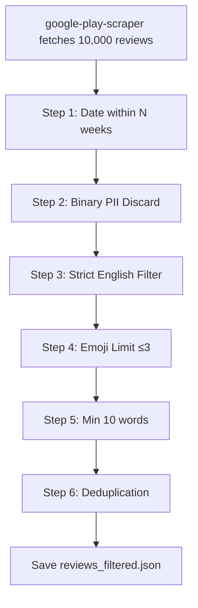

**The 6-Step Filter Pipeline:**

| Step | Filter | Logic | Why |
|------|--------|-------|-----|
| 1 | Date Window | `review_date >= (now - max_weeks)` | Only recent reviews are relevant |
| 2 | PII Discard | Binary — if `has_pii()` returns True, the review is **permanently deleted** (not redacted) | Legal compliance, privacy |
| 3 | English Only | `is_english_strict()` — every word must be Latin charset + langdetect must return 'en' | LLM prompts are English; Hindi/Hinglish becomes noise |
| 4 | Emoji Limit | `count_emojis() <= 3` | Excessive emojis corrupt LLM analysis |
| 5 | Word Count | `len(text.split()) >= 10` | "Good app" has zero analytical value |
| 6 | Deduplication | Set-based content deduplication | Remove exact duplicates |

### Real-Life Use Case: The "Noise" Problem
**Problem:** A product manager spends 4 hours a week reading "Good app" or "Mera paisa wapas karo" (Hindi) or reviews filled with spam phone numbers. None of this is actionable.
**Solution:** Phase 1 architecture ensures that 10,000 "raw" reviews are distilled into ~100 "high-signal" English reviews. It automates the "noise cancellation" that used to be a manual, soul-crushing 4-hour task.


**Caching:** Reviews are cached for 24 hours. Within TTL, the scraper returns cached data without re-fetching. Configurable via `scraping.cache.reviews_ttl_hours`.

### 6.2 Fee Scraper (`scraper_fees.py`)

**What it does:** Fetches Groww's `/pricing` page via `requests`, parses HTML tables with BeautifulSoup, and extracts fee data for Stocks, F&O, and Mutual Funds.

**Architecture Note:** Uses `requests` (2MB) instead of Playwright (~150MB) for Vercel Serverless compatibility. Each asset class has a dedicated scraping function (`_scrape_stocks`, `_scrape_fno`, `_scrape_mutual_funds`) with a mock fallback if the page structure changes.

**Caching:** Fee data is cached for 7 days (`scraping.cache.fee_kb_ttl_hours: 168`). Fee structures change rarely.

---

## 7. Phase 2: LLM Routing Engine

### ELI5
> You have two smart assistants: a fast one (Groq) and a thoughtful one (Gemini). For sorting stacks of letters, you use the fast one (and you have 3 copies of his desk key so if one gets overloaded, you use the next). For writing the final executive summary, you use the thoughtful one. If one assistant is sick, the other takes over.

### How the LLM Router Works

The `LLMRouter` class implements two specialized routes with automatic failover:

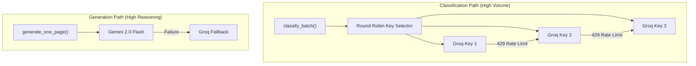

### Multi-Key Rotation (Groq Free Tier Strategy)

Groq's free tier enforces strict rate limits per API key. We bypass this with **3 API keys** cycled via round-robin:

```python
def _get_next_groq_key(self) -> str:
    key_id = self._keys_list[self._current_key_index]
    self._current_key_index = (self._current_key_index + 1) % len(self._keys_list)
    return key_id
```

When Key 1 hits a `429`, the router automatically rotates to Key 2. If Key 2 also hits `429`, it rotates to Key 3. This triples the effective throughput.

### Parallel Batching

`classify_batch()` distributes review chunks across keys using `ThreadPoolExecutor`:
- Failed chunks are logged but don't block other chunks

### Real-Life Use Case: The "Free Tier" Problem
**Problem:** You want to build a production-grade AI tool but have a $0 budget. Free LLM tiers like Groq have tiny rate limits that crash typical apps after 2-3 requests.
**Solution:** Phase 2's **Multi-Key Rotation** mimics a "Paid Tier" by spreading load across 3 free accounts. If one account is throttled, the architecture automatically "flips the switch" to the next key. It makes the system robust for zero cost.


### `LLMResponse` Dataclass

Every LLM call returns a structured object:

| Field | Type | Description |
|-------|------|-------------|
| `content` | `str` | Raw text or JSON from the LLM |
| `provider` | `str` | `"groq"` or `"gemini"` — which provider actually responded |
| `tokens_used` | `int` | Total tokens consumed |
| `latency_ms` | `int` | Wall-clock time in milliseconds |
| `model` | `str` | Exact model name used |
| `key_id` | `str` | Which Groq key was used (None for Gemini) |

---

## 8. Phase 3: Weekly Review Pulse (Part A)

### ELI5
> You have a big stack of complaint letters. Sort them into piles by topic (themes). Count which piles are biggest (top 3). Pull out the 3 most interesting quotes word-for-word. Write a short summary. Suggest 3 things to fix. That's the Weekly Pulse.

### Map-Reduce Pipeline

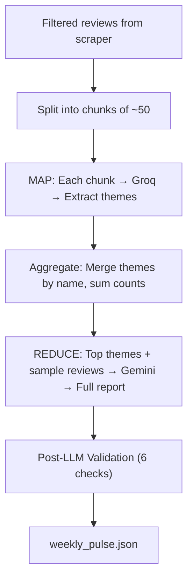

**MAP Phase (Groq — Classification):**
- Reviews are split into chunks of ~50
- Each chunk is sent to Groq with a system prompt: "Extract themes from these reviews"
- Groq returns JSON with `{themes: [{name, review_count, avg_rating}]}`
- Chunks are processed in parallel via `classify_batch()`

**REDUCE Phase (Gemini — Generation):**
- All extracted themes are aggregated (merge by name, sum counts, weighted average ratings)
- The top 10 themes + 150 worst-rated reviews are sent to Gemini
- Gemini generates: top 3 themes, 3 verbatim quotes, executive summary (≤250 words), 3 action ideas

### Post-LLM Validation (6 Checks)

| Check | Rule | Auto-Fix |
|-------|------|----------|
| 1 | Top themes must be exactly 3 | Pad with "Needs Analysis" or truncate |
| 2 | Quotes must be exactly 3 | Sample from worst reviews if LLM missed any |
| 3 | Summary must be ≤250 words | Truncate at 250th word, append "..." |
| 4 | Action ideas must be exactly 3 | Pad or truncate |
| 5 | No PII in output | Regex scrub emails and phones from all text |
| 6 | Theme metrics | Calculate percentage and average rating per theme |

### Real-Life Use Case: The "Data Blindness" Problem
**Problem:** A CEO asks "What's the #1 reason people hate the new update?" and gets a 50-page PDF of raw reviews. They can't find the answer.
**Solution:** Phase 3 turns that 50-page mess into a single JSON "Pulse card" showing "App Crashes: 26%". It provides instant, quantitative clarity from qualitative mess.


---

## 9. Phase 4: Fee Explainer (Part B)

### ELI5
> Your friend asks "How much does it cost to trade stocks on Groww?" Instead of making something up, you open Groww's official price list (the knowledge base you scraped), read the numbers, and write 6 simple bullet points explaining each charge. You add a link to Groww's website so they can verify.

### Anti-Hallucination Strategy (KB-Grounded Prompting)

**The Problem:** LLMs hallucinate. They can invent fee amounts or charges that don't exist.

**The Solution:** The LLM prompt contains **only** the fee data from `fee_kb.json`. The system prompt explicitly instructs:

> *"Use ONLY the fee data provided below. Do NOT add any fees not present in the data. If unsure, do NOT include it."*

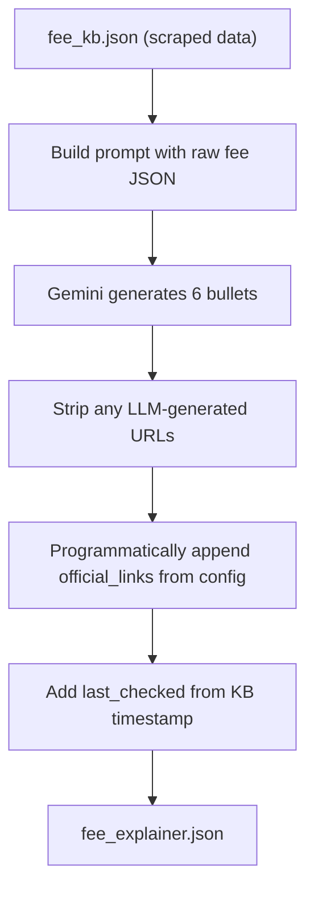

**Critical Rule:** The `official_links` and `last_checked` fields come from `fee_kb.json` and `config.yaml`, **never** from the LLM. This eliminates hallucinated URLs entirely.

### Real-Life Use Case: The "Hallucination" Problem
**Problem:** An AI assistant tells a user "Groww charging ₹50 for stocks" when the real price is ₹20. This leads to user anger and potential legal trouble.
**Solution:** Phase 4 uses **KB-Grounded Prompting**. The AI isn't allowed to "remember" prices; it's forced to "read" the provided price list. The architecture treats the AI like a translator, not a memory bank.


---

## 10. Phase 5: FastAPI Backend

### ELI5
> You've built all the smart parts. Now you put them behind doors that the frontend can knock on. There are 3 doors: `/pulse`, `/explainer`, and `/dispatch`. Each door checks your password, validates what you pass in, runs the right pipeline, and hands back a JSON response.

### API Security Middleware

Every request (except `/health`, `/docs`) must include a valid `X-API-KEY` header. This prevents unauthorized access to expensive LLM API quota:

```python
@app.middleware("http")
async def api_key_validation(request, call_next):
    expected = os.getenv("BACKEND_API_KEY")
    provided = request.headers.get("X-API-KEY")
    if expected and provided != expected:
        return JSONResponse(status_code=401, content={"error": "Unauthorized"})
```

### Request/Response Flow

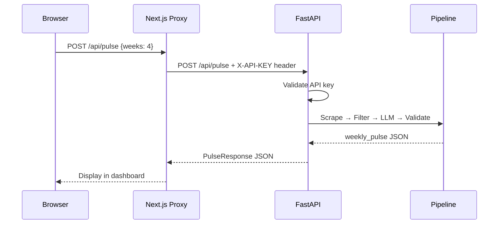

### Three API Endpoints

| Endpoint | Purpose | Key Logic |
|----------|---------|-----------|
| `POST /api/pulse` | Generate Weekly Review Pulse | Scrape reviews → apply UI filters → Map-Reduce LLM pipeline |
| `POST /api/explainer` | Generate Fee Explainer | Scrape fees → KB-grounded LLM generation → anti-hallucination validation |
| `POST /api/dispatch` | Send to Google Docs/Gmail | Format content → check gate approvals → launch MCP subprocess |

### Real-Life Use Case: The "Silo" Problem
**Problem:** All the AI analysis lives inside a developer's terminal or a private database. The Operations team can't see it or use it.
**Solution:** Phase 5 exposes these pipelines via a standard web API. Any frontend (Web, Mobile, Slack Bot) can now "talk" to the intelligence engine and get structured answers.


---

## 11. Phase 6: Next.js Frontend

### ELI5
> This is the control panel the user sees. Knobs and switches on the left (sliders, dropdowns, toggles), and a TV screen on the right showing results. When you press a button, it secretly passes your request to the backend and shows whatever comes back.

### UI Architecture

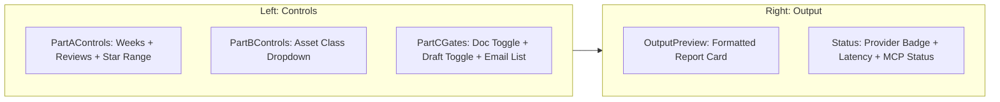

**Why proxy instead of direct calls?**
1. **Security:** `BACKEND_API_KEY` stays on the server — never exposed to the browser
2. **CORS:** Browser-to-backend cross-origin issues are eliminated entirely
3. **Flexibility:** Backend URL can change without any frontend code changes

### Real-Life Use Case: The "Accessibility" Problem
**Problem:** The backend is brilliant, but nobody knows how to use cURL or Postman.
**Solution:** Phase 6 provides a premium, "one-click" interface. A business user can generate a complex AI report by just moving a slider. The architecture bridges the technical-business gap.


---

## 12. Phase 7: MCP Integration (Part C)

### ELI5
> You've written a report. Now you need to share it. You paste it into a shared Google Doc (so the team can reference it), and create an email draft in Gmail (so you can review before sending). A "gate" system ensures nothing happens without your explicit approval.

### What is MCP (Model Context Protocol)?

MCP is a standardized protocol for AI systems to interact with external tools. Think of it as **"USB for AI"**. Just as a USB mouse works on any computer because both follow the USB protocol, an AI tool (MCP Server) can work with any AI Assistant (MCP Client) because they both speak the MCP protocol.

### 12.1 The Client-Server Model

In a standard MCP setup:
- **The Client (LLM side):** The entity that asks for a tool to be run (e.g., Claude, Gemini, or in our case, the `MCPDispatcher`).
- **The Server (Tool side):** The entity that actually executes the code (e.g., our `google_mcp_server.py`).

**How it works in this project:**
1. **FastAPI (The Orchestrator)** decides it needs to write to Google Docs.
2. It calls **MCPDispatcher (The Client Proxy)**.
3. The Client Proxy spawns **google_mcp_server.py (The MCP Server)** as a separate process.
4. They talk via **JSON-RPC over Pipes (stdio)**.

### 12.2 Intricate Details of the Dispatch Flow

When you click "Append to Google Doc":
1. **The Request:** FastAPI sends the report text to `mcp_dispatcher.py`.
2. **The Handshake:** The Dispatcher starts the server and sends an `initialize` request. The Server responds with its name, version, and capabilities (e.g., "I can write to Docs and Gmail").
3. **The Call:** The Dispatcher sends a `tools/call` message. It doesn't just say "run Python code"; it says **"Execute the tool named 'documents.appendText' with these specific arguments"**.
4. **The Execution:** The Server receives the message, looks up its internal function for `documents.appendText`, handles OAuth2 auth, and hits the Google API.
5. **The Reply:** The Server sends a JSON-RPC response back: `{"result": {"content": [{"type": "text", "text": "success"}]}}`.
6. **The Termination:** The process closes. This is a "Stateless MCP" pattern.

### 12.3 Setup on Different Interfaces

| Interface | Setup Method | Problem Solved |
|-----------|--------------|----------------|
| **Local (macOS)** | Reads `token.json` from the filesystem. | Ease of development. You run `auth.py` once, and your local machine is authenticated forever. |
| **Cloud (Vercel)** | Reads `GOOGLE_TOKEN_JSON` from Environment Variables. | **The "Read-Only Cloud" Problem.** Cloud servers (Vercel) don't allow permanent file storage. By putting the token in an Env Var, the MCP Server can "re-create" the token in memory every time it runs. |
| **Internal (Subprocess)** | Uses `sys.executable` for venv inheritance. | **The "Dependency" Problem.** If the Server ran with system Python, it wouldn't find the Google API libraries. By forcing it to use the same Python as the parent, we ensure it has the right "brain." |

### 12.4 Why MCP is useful here?

Instead of writing custom code to talk to Google Docs, we built an **MCP Server**. This is future-proof:
1. **Portability:** If you wanted to move this to a different AI framework tomorrow, you don't rewrite the Google Docs code. You just connect the new framework to this MCP server.
2. **Security:** The logic for "how to write to a doc" is isolated in a separate, small process. The main API doesn't need to know Google API internals.
3. **Standardization:** It follows the community standard (Model Context Protocol), making it easier for other developers to understand and maintain.


### How the Subprocess Communication Works

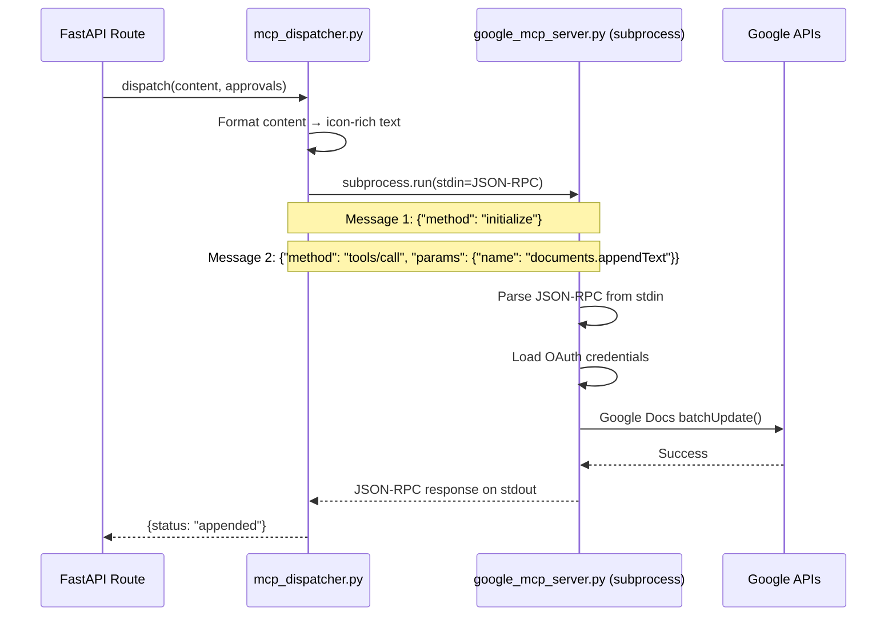

**Key Technical Detail:** The dispatcher spawns `google_mcp_server.py` as a **child process** using `subprocess.run()`. It writes two JSON-RPC messages to stdin (initialize + tools/call), then reads stdout for the response. The subprocess exits after processing. This design avoids keeping long-lived connections open in a Serverless environment.

### Gate System

| Gate | Condition | Side Effect |
|------|-----------|------------|
| Gate 1 (Doc) | `approvals.append_to_doc == true` | Appends report to Google Doc on a new page |
| Gate 2 (Draft) | `approvals.create_draft == true` | Creates Gmail draft (does NOT send) |

Both gates default to OFF. They are completely independent — if Doc append fails, Draft creation still proceeds.

### OAuth2 Authentication

**Local:** Reads the physical `token.json` file generated by running `python -m backend.phase7.auth`

**Vercel (Cloud):** Reads the `GOOGLE_TOKEN_JSON` environment variable and parses it directly into memory using `Credentials.from_authorized_user_info()`. This bypasses the read-only filesystem entirely.

```python
def get_credentials():
    token_env = os.environ.get("GOOGLE_TOKEN_JSON")
    if token_env:
        return Credentials.from_authorized_user_info(json.loads(token_env)), "success"
    if os.path.exists("token.json"):
        return Credentials.from_authorized_user_file("token.json"), "success"
    return None, "No credentials available"
```

---

## 13. Deployment Architecture

### Vercel Dual-Project Topology

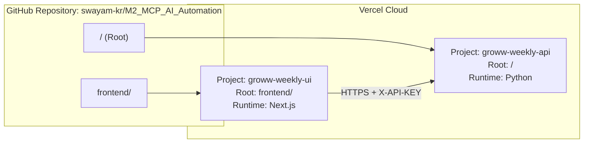

**Why two projects?** The same GitHub repository serves both. Vercel routes the backend project through `api/index.py` (which imports the FastAPI app) and the frontend project through Next.js's standard build system.

### Environment Variables

**Backend (`groww-weekly-api`):**

| Variable | Purpose |
|----------|---------|
| `GROQ_API_KEY_1`, `_2`, `_3` | Three Groq API keys for round-robin rotation |
| `GEMINI_API_KEY` | Google Gemini LLM access |
| `GOOGLE_OAUTH_CLIENT_ID` | OAuth2 app identity |
| `GOOGLE_OAUTH_CLIENT_SECRET` | OAuth2 app secret |
| `GOOGLE_DOCS_DOC_ID` | Target Google Doc for report appending |
| `BACKEND_API_KEY` | Shared secret for frontend authentication |
| `GOOGLE_TOKEN_JSON` | Full `token.json` contents for stateless cloud auth |

**Frontend (`groww-weekly-ui`):**

| Variable | Purpose |
|----------|---------|
| `NEXT_PUBLIC_BACKEND_URL` | URL of the deployed backend API |
| `BACKEND_API_KEY` | Same shared secret (attached as X-API-KEY header) |

---

## 14. Security Model

| Layer | Mechanism | What It Protects |
|-------|-----------|-----------------|
| **API Gateway** | `X-API-KEY` header validation | Prevents unauthorized LLM API usage |
| **OAuth2** | `token.json` / `GOOGLE_TOKEN_JSON` | Scoped Google Docs + Gmail access only |
| **CORS** | `allow_origins=["*"]` (dev), restrict in prod | Prevents cross-origin attacks |
| **PII Binary Discard** | Reviews containing emails/phones are permanently deleted, not redacted | Legal compliance |
| **MCP Gates** | All dispatch operations default to OFF | No accidental doc/email modifications |
| **Environment Variables** | All secrets stored in Vercel env vars, never in code | Prevents credential leaks |

---

## 15. Architectural Constraints

These are **hard rules** enforced by the codebase. Violating any is a bug.

| # | Constraint | Enforced By |
|---|-----------|-------------|
| 1 | **LLM Routing:** Always try Groq first, Gemini only on failure | `llm_router.py` — `generate_one_page()` |
| 2 | **Phase Independence:** Each module is testable in isolation | Clear input/output contracts per file |
| 3 | **Human-in-the-Loop MCP:** No dispatch without explicit UI toggle ON | `PartCGates.tsx` + `mcp_dispatcher.py` gate checks |
| 4 | **Binary PII Discard:** Reviews with PII are deleted, not scrubbed | `scraper_reviews.py` — `has_pii()` check |
| 5 | **Strict English Only:** Non-Latin words → immediate discard | `is_english_strict()` with langdetect + Unicode check |
| 6 | **Token Budget:** Never exceed LLM context window; auto-chunk via Map-Reduce | `fits_in_context()` + `_chunk_reviews()` |
| 7 | **Cache TTL:** No re-scrape within TTL unless forced | `is_cache_valid()` — Reviews: 24h, Fees: 168h |
| 8 | **Anti-Hallucination:** Fee URLs/timestamps never from LLM | `pipeline_fees.py` — programmatic append |
| 9 | **Stateless Cloud:** All file I/O routes to `/tmp` on Vercel | `_resolve_path()` in `utils.py` |
